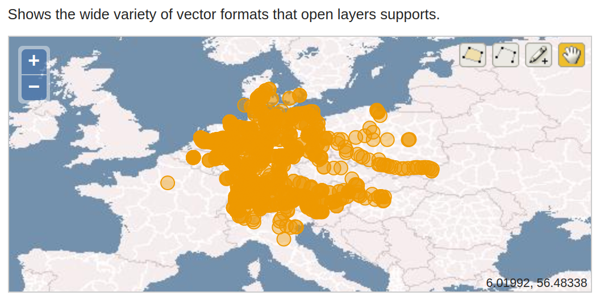
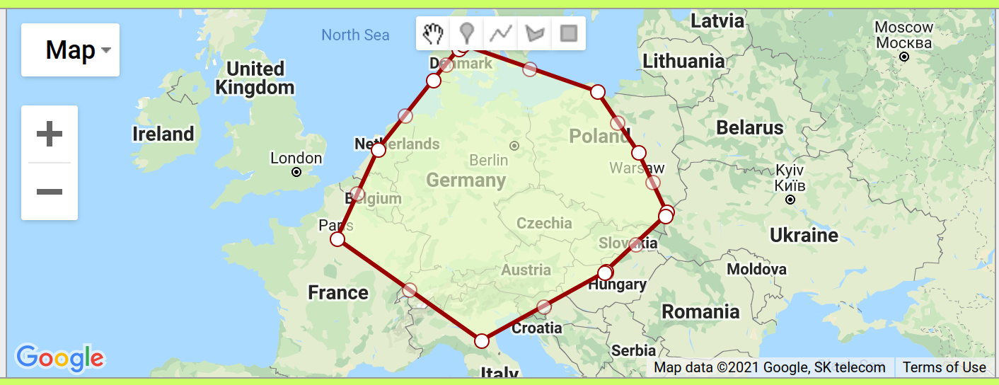

# GTFS2RDF

### Download GTFS dump


### Convert GTFS data to RDF
Given that the GTFS data is in CSV format, we use RML as mapping language.

As conversion tool we use the Java based [RMLMapper](https://github.com/RMLio/rmlmapper-java).

The mappings are contained in the file [gtfsde-rml.ttl](https://github.com/moin-project/GTFS2RDF/blob/main/rml/gtfsde-rml.ttl)

Moreover, we make use of custom functions during the mappings process:
- the GTFS data for `departure_time` and `arrival_time` of the `stop_times.txt` file an have invalid data w.r.t. to e.g. `xsd:time` datatype, see the [specs](https://developers.google.com/transit/gtfs/reference#stop_timestxt):

> For times occurring after midnight on the service day, enter the time as a value greater than 24:00:00 in HH:MM:SS local time for the day on which the trip schedule begins.

This means, there can be time data like `25:12:12` when the departure time is on the next day after the arrival time. This in fact leads to invalid for a time literal and makes triple stores fail when loading the data. Therefore, we use a custom function which normalizes the values, i.e. the former examples becomes `01:12:12`


After cloning and building the Github project, we use the CLI to generate the RDF data from the GTFS CSV data:

```bash
java -jar "$CWD/rmlmapper.jar" -v -f "$CWD/functions_moin.ttl" -m "$CWD/gtfsde-rml2.ttl"

```


### Download Wikidata Geospatial station data

For linking the stop locations to Wikidata there are different opportunities:
1. Wikidata itself does have a GeoSpatial index which makes it possible to search for places nearby given coordinates:

```sparql
SELECT ?place ?placeLabel ?location ?dist WHERE {
  SERVICE wikibase:around { 
      ?place wdt:P625 ?location . 
      bd:serviceParam wikibase:center "POINT(6.04541 50.731915)"^^geo:wktLiteral . 
      bd:serviceParam wikibase:radius "0.5" . 
      bd:serviceParam wikibase:distance ?dist.
  } 
  # optionally, check if the entity is a station
  # FILTER EXISTS { ?place wdt:P31/wdt:P279* wd:Q12819564 }
  SERVICE wikibase:label {
    bd:serviceParam wikibase:language "de" . 
  }
} ORDER BY ASC(?dist)

```

The main problem here is the amount of GTFS stops we have:

```bash
awk -vFPAT='([^,]*)|("[^"]+")' -vOFS=, '{ print $2 }' $DIR/stops.txt | sort -u | wc -l
```
The GTFS.de dump of 08 March:

| Dataset | #stop ids | #stop names | #lat/long |
| --- | ---: | ---: | ---: |
| Fernverkehr | 1,349 | 514 | 513 |
| Regionalverkehr | 14,191 | 7,336 | 7,685 |
| Nahverkehr | 456,786 | 281,463 | 409,985 |

Sending thousands of single requests is rather slow and might lead to being blocked by the server.

As an alternative, we could gather the station data from Wikidata with the following query. Currently there are `6281` German transport stops with coordinates in Wikidata:

```sparql
SELECT (count(distinct ?place) as ?cnt) {
  ?place wdt:P31/(wdt:P279)* wd:Q548662 ;
         wdt:P17 wd:Q183 ;
         wdt:P625 ?location 
 }
```
To get the appropriate triples with WKT serialization we can run

```sparql
PREFIX bd: <http://www.bigdata.com/rdf#>
PREFIX wd: <http://www.wikidata.org/entity/>
PREFIX wdt: <http://www.wikidata.org/prop/direct/>
PREFIX wikibase: <http://wikiba.se/ontology#>
PREFIX skos: <http://www.w3.org/2004/02/skos/core#>
PREFIX rdfs: <http://www.w3.org/2000/01/rdf-schema#>
PREFIX wgs: <http://www.w3.org/2003/01/geo/wgs84_pos#>
PREFIX geo: <http://www.opengis.net/ont/geosparql#>

 CONSTRUCT {
 ?place 
             geo:hasGeometry [ a geo:Geometry ; geo:asWKT ?location ] ;
           rdfs:label ?placeLabel ;
             #wdt:P31 ?type
             #rdfs:comment ?placeDescription ;
             #skos:altLabel ?placeAltLabel
 } WITH {  
    SELECT DISTINCT ?place where {      
    	?place wdt:P31/(wdt:P279)* wd:Q548662 ;            
               wdt:P17 wd:Q183 ;
     }
  } AS %places
   WHERE {
    
   INCLUDE %places
   ?place wdt:P625 ?location .
          #wdt:P31 ?type 
   #BIND(bnode(str(?location)) as ?geom)
   #hint:Query hint:queryEngineChunkHandler "Managed"
   hint:Query hint:constructDistinctSPO false . 
   SERVICE wikibase:label { bd:serviceParam wikibase:language "de,en". }                  
 }

```
There seems to be some issue with the `CONSTRUCT` optimizer, in particular, without the query hint this query is missing triples randomly in the result on each execution, for example the location of `wd:Q681785` isn't contained in the triples. 

The previous query does only return transport stop data for Germany, the GTFS dataset for _Fernverkehr_ will need additional data from other European countries:

TODO

This data can be loaded into a local triple store with GeoSPARQL support in addition to the GTFS data we converted in the previous step.

### Geo-Matching the GTFS and Wikidata entities

Then, a SPARQL query with GeoSPARQL can be used to find matching candidates based on the coordinates:

```sparql
PREFIX geo: <http://www.opengis.net/ont/geosparql#>
PREFIX geof: <http://www.opengis.net/def/function/geosparql/>
PREFIX unit: <http://qudt.org/vocab/unit#>
PREFIX uom: <http://www.opengis.net/def/uom/OGC/1.0/>
PREFIX wgs: <http://www.w3.org/2003/01/geo/wgs84_pos#>
PREFIX foaf: <http://xmlns.com/foaf/0.1/>

SELECT DISTINCT ?wdEntity ?wdEntityLabel ?wdPoint ?stop ?stopName ?stopPoint where {
  ?wdEntity geo:hasGeometry ?wdGeom ;
            rdfs:label ?wdEntityLabel .
  ?wdGeom geo:asWKT ?wdPoint .
  
  ?stop geo:hasGeometry ?stopGeom ;
        foaf:name ?stopName .
 ?stopGeom geo:asWKT ?stopPoint .
 
 ?wdGeom geof:nearby (?stopPoint 1 unit:Kilometer)
}
order by ?wdEntityLabel ?stop
```
Depending on the max. nearby distance given, there might be multiple matches per stop. In that case we could a) simply use the nearest Wikidata entity or b) add compute some additional similarity measure based on the names.

#### LIMES
If we're doing a more sophisticated interlinking, LIMES would be the first choice here. It allows to combine multiple metrics and provides for string similarity measure as well as geospatial measures.

Usage: Download latest LIMES from [here](https://github.com/dice-group/LIMES/releases)

```
java -jar limes-core-1.7.4.jar limes_config.xml
```
The config file contains either a path to the files containing both datasets or the SPARQL endpoint URL. If we load all data into a single SPARQL endpoint  - as we did in our case - we can add some additional graph pattern to distinguish the source and target entities.

TODO show config
TODO process output

### Reverse Geocoding
We also apply reverse geocoding by using OSM data via nominatim to gather address data. While there is a public Nominatim service, it's not meant to be used heavily, thus, we setup our local Nominatim with OSM data for Germany. Luckily, there is a Docker setup that basically does what we need, thus, we only have to setup Docker and run

```
docker run -it --rm \
  -e PBF_URL=https://download.geofabrik.de/europe/germany-latest.osm.pbf \
  -e REPLICATION_URL=https://download.geofabrik.de/europe/germany-updates/ \
  -e IMPORT_WIKIPEDIA=true \
  -p 8888:8080 \
  --name nominatim \
  -v nominatim-data:/var/lib/postgresql/12/main \
  mediagis/nominatim:3.6
```
This takes "some" time ... 
Afterwards, the service will be available at port 8888 - change it if this port is already been used.

#### Call Nominatim from SPARQL
We can use Apache Jena custom Javascript based functions to call Nominatim directly from SPARQL and add RDF triples to the existing dataset:
```
update --data data.nt --set arq:logExec=FINE --set arq:js-library=arq-functions.js --update GTFS2RDF/queries/add_osm_address_data.ru --dump > data_with_osm.nt
```


## Simplifying Polygons

The following example shows how to compute a convex hull in SPARQL using spatial extensions.
The [RDF Processing Toolkit](https://github.com/SmartDataAnalytics/RdfProcessingToolkit/) is a convenient tool for that purpose.


```bash
java -jar rpt.jar integrate gtfs.nt hull.sparql
```

```sparql
#hull.sparql

PREFIX wgs: <http://www.w3.org/2003/01/geo/wgs84_pos#>
PREFIX spatialF: <http://jena.apache.org/function/spatial#>
SELECT
  ?points
  (geof:convexHull(?points) AS ?convexHull)
{
  SELECT (geof:collect(?point) AS ?points) {
    []
      wgs:lat ?lat ;
      wgs:long ?lon ;
    .

    BIND(spatialF:convertLatLon(?lat, ?lon) AS ?point)
  }
}

# Convex hull polygon:
# POLYGON((48.876976 2.35912, 44.50614 11.343411, 47.464355 19.020456, 47.50038 19.085072, 49.78366 22.776363, 49.939533 22.829151, 52.25155 21.052336, 54.52084 18.529556, 56.150074 10.204997, 56.043564 9.924497, 54.906837 8.310925, 52.37919 4.899431, 48.876976 2.35912))
```





## Convert Reachability Data to RDF
### Input
The current data is avaibale at https://project.nes.uni-due.de/moin/data/
It comprises data for 20 up to 200 cities with information about driving duration, distance and route.
For example the city Berlin
```json
{
      "id": 45108,
      "creationTime": 1578754123907,
      "modificationTime": 1584057162560,
      "deleted": false,
      "coordinate": {
        "latitude": 52.5170365,
        "longitude": 13.3888599
      },
      "timezone": "Europe/Berlin",
      "capital": true,
      "population": 3531201,
      "wikipedia": "de:Berlin",
      "type": "CITY",
      "country": {
        "id": 560,
        "creationTime": 1578750581221,
        "modificationTime": 1584055362236,
        "deleted": false,
        "coordinate": {
          "latitude": 51.0834196,     "es": "Alemania",
          "it": "Germania"
        }
      },
      "state": {
        "id": 2741,
        "creationTime": 1578750897659,
        "modificationTime": 1578750897659,
        "deleted": false,
        "coordinate": {
          "latitude": 52.506934799999996,
          "longitude": 13.397482681501469
        },
        "timezone": "Europe/Berlin",
        "population": 3440441,
        "wikipedia": "de:Berlin",
        "country": {
          "id": 560,
          "creationTime": 1578750581221,
          "modificationTime": 1584055362236,
          "deleted": false,
          "coordinate": {
            "latitude": 51.0834196,
            "longitude": 10.4234469
          },
          "names": {
            "en": "Germany",
            "local": "Deutschland",
            "fr": "Allemagne",
            "de": "Deutschland",
            "es": "Alemania",
            "it": "Germania"
          }
        },
        "names": {
          "en": "Berlin",
          "local": "Berlin",
          "fr": "Berlin",
          "de": "Berlin",
          "es": "Berlín",
          "it": "Berlino"
        }
      },
      "names": {
        "en": "Berlin",
        "local": "Berlin",
        "fr": "Berlin",
        "de": "Berlin",
        "es": "Berlín",
        "it": "Berlino"
      }
    }
```
and routing data like 
```json
{
        "distance": 476101.81811425375,
        "drivingDistance": 574141.9718600416,
        "drivingDuration": 19090,
        "drivingRoute": "mfp_I}~upAdMkAt@bYhBbQkFzBnB`XqEUcChC`IlzC{ArKhCnHnIv{CsAzIxBdGtNtpF`Ll@nEyC`RnDrFjDjAjFLtJpAlEtyBryC`}@|eAjhF|dHnHnDje@nGxHuDxJ_PnEmCpu@aKnPjBxH~F`dAdmAbNjThIbYbXfdB|FvOjHbJfd@tWlKnDdx@CtIjBhJnHlSd_@zM|JtHfAhbB{@`JnBpMnInJdMhI~Tfg@niClJnVfjAnnAblAxr@|GnJ`GvRfB`V@n\\mCbxCbBlUfLfi@r@nY{ArRyWfwAsBbUaA~{ElCvZneAzsH`CvV?|NmA|LiD|LieDfoIcJl_@yz@plE_JvRsPjOeFzHuEnMyCdRkEdcBsMn_De@`]`In_DeB`dC`]l`HTvk@gFdo@{jAvmG_Ifo@{Az]k@jlAgA|wD~@zl@tE~j@|Jfk@zh@ntBrPz`@rSpWr_ChrBj]z_@|wBtkCdo@fjAjOj^nGjWjFra@hnAfwPnJpc@hsAzhEnEhRtEd]fBl]Eha@cGvmBiYzjH[va@|@xWnxBb_]J`V}RhjMbKj~LjDnhAdj@llJfCrn@_VzyJj@zj@|^jsDrYn~GbGpo@tI|^hI`TtxC|jGdPhh@flB|xKt]zjEtAn`@qAxi@oFrc@}Ij^}q@`}BqbApkFwExb@y@dVD~]hFlmF`@tdEk@dg@k\\~cIeq@p{JoPnwHcEnc@iUh`BiDtd@q@~|@xFffBiFxqBkHvr@cb@vxBoDfk@gDlwAeDla@qGh]ob@vzA}p@vmBgIxNa\\rc@aWhn@aNfVamAnnAyUz]aMn\\sPbs@iElWoI`hAyFfa@qG~Vod@xtAoLji@eF~e@yJjiB}I~n@{In^ynAj~D}t@zkDuFv]}D~a@mRzfFw@zt@`Bji@x\\xkGpBniC}H~sHm@j~GeRr`GwBzjGwA|b@}Dfd@czAb|Jcd@v~EcMntCoHz_CsDdnD~@zx@|[j`GHtf@wHjkDZfdB_Btq@_Hhp@qJbe@qd@hxAqu@htByKlf@sFpb@m\\xyGaB|x@cA`cBkPxsDgJlw@}yAt~Hi_@tpCoCtd@aKxwEuUzvDyWdkFeGpu@iE`YgMtf@}r@boBi|@leB{Udl@qMve@aMnl@yHxq@k@|Wh@p`@|R~oBjCbaAkBj|FoOngCg@t|@vJfpCld@jbEpBvTd@|UvBnORjr@eM|zC}@diA`Kx|ChCvkB`C~a@|Dr]|Mpo@zObd@xdBlrDfKpRfyAl{BrkAbaCh{@pmAzMbOvr@ln@jg@dYfShRxz@|yAl\\du@xWf`@tzD|gDvNhPpx@`xAjdAloChQnXd_@t]bQpUll@v{AlN~Tv]~_@nM|QzKlVhHhWzGpc@bWxlD|GjVjd@t|@fH~VfCdZ[pk@dAnSzb@~hCjAvOeA`vAqLpw@mGnbAcAx|@{DxaAfC`i@PnVkJ`hAh@pYrG|nAkGxkC|BlWlLhj@jBjY{Ar]wNhqAwDptA|@vQbJrp@fD~q@pJlj@rAvOUlkCv@tb@`Db]lLnw@rDxs@jN|aAfC`a@Xv}BoIpoA`Ahx@kAhfA`Ap|@nC|UbQft@xKfv@xDbQhFtLbLzMpt@dc@nT`Gx[tAbK`D~_A|r@drA|Yll@de@|LxUj\\noA~YjjBdHt}AzFho@tFxY~GnQhLdPvT~MjP|Ap{@gH|ShGzOpNpl@rdAzo@deBrJrSvKfQr\\d_@lL|Qtm@fmBpO`ZdUzX|[zT`jAbYty@ja@vSzOh`@tk@dRdQzQzIvlAt[~X`LjsAnaA`oAha@bK`@`ZaDf`@fC|KrBjK`I~HxNpSbn@v^|jBpJf`@`Mx\\ne@`aA`j@xsBlMz[hKhP|P|P|j@pWjZnSx}AleBbUt`@pHpTfHl^zN|gAbVf~BpM|r@vUbu@bd@|{@xLnYdu@znBzKza@lFbb@nR|tCtl@jfDlQ~wBbDnWvH|^dc@`mA`l@vdDbi@jvBpFjYv|@riLxIjr@fo@bjDjX|bBfYr_AdE|RjTxmBpXfhBvdBtkHfh@tnDbEfSxG`TdJhRnKlNlL`KxlGfaDrWnFn}AjFtO`EtOpIhNrM|}B|rClMjUr_@f_AvM`TjShR|yAtcAxMrO~K~RxKb[zo@d`Cnv@v{CvFn^tB|ZvIjfE|Fn}@tYhxCvb@~mDr}@rkGpDh]hAnZCpgAiAbPqHdRAxHbChI|DzDbEf@|JiIbFeA`q@vMpThNvTdRnYl_@pQvQxQfMtW`KlTjDhyBzK|dCv\\~yA~f@|N`IdNpMrnApmBdf@xh@~Mh[fM~j@lInU`KjOng@fi@pJjQ`JrUfTv{@l~@``FdKrZfKvO`O~Kd|Anc@~RvOrGhNvIl[`FjLrm@vy@lWph@fM~_@dIt^d^fkCnVj_AvKxt@vFpVhL~VbLnMrK~Gfu@tYfItG~HtN`p@p|Bp_@bcAxIxYtLpj@`Dj^xFzRlEne@xElV~GdPpRnV|HrO`EvOzFbi@hDlPzv@`oBjb@hcAnYpa@pMxYhIh`@dLxgA`Mrm@lRnj@hj@bkAdK~NxNrKtItCxx@lK|\\lTtL|DlOGlq@ePrN~BfG|FhOxUfYtRbGfMvKf`@~Tz\\n]b{@jJnL`OzGrQJjWkFxLkFhPeMfIeC|]jDjO{DpKyLrp@ssA|HuLjPqNpWoHbVz@fTfJjKtJlu@p~@hNtIrUxA~tAoJzOv@xNlEn~@lq@lLlO`GbQjWvzA|GpPtb@j^tXll@rIlLlGdEnUdGxMtGnK|J`KvOzLp^lVjyApIj`@pJzXhOtW~[z]nRnOpPfE|ZOvQhEhzAn}@xRtRdNxYhIh_@fPdgAdSlyBfFp[jJx[bq@tdBpHlVfi@b|BnNpkAxEvX~Rf}@d\\bpAbDlWpA|WS~_@}Ezy@l@zXpDbW|HlTfsAbyCvOtb@zTfv@jNp]nPd[bo@`dAfRf`@bTrv@b@rIsCh@c@uCbAkDtr@kcA~b@}i@~e@kg@nWsQvd@oSbf@oe@p_@sQva@oa@rEXjIiBxT}t@nDwTvBi]|EKaA_QCkWvJs@CdIlC?C_GbCd@"
      }
```


This data can be converted by means of the folowwing SPARQL Update statements using the RDF Processing Toolkit (RPT):

``` sparql
# insert the connection data
PREFIX moin: <http://moin-project.org/data/>
PREFIX moino: <http://moin-project.org/ontology/>
PREFIX owl: <http://www.w3.org/2002/07/owl#>
PREFIX url: <http://jsa.aksw.org/fn/url/>
PREFIX json: <http://jsa.aksw.org/fn/json/>
PREFIX xsd: <http://www.w3.org/2001/XMLSchema#>

INSERT {
	?src moino:connectedTo ?target .
	<<?src moino:connectedTo ?target>> moino:drivingDuration ?drivingDuration ;
		                           moino:drivingDistance ?drivingDistance ; 
		                           moino:transportType ?transportType ;
		                           moino:route ?routeWkt ;
		                           owl:sameAs ?item 
} WHERE {
  # currently hard-coded as we only have car driving data
	BIND(moino:car as ?transportType)
  
  # directly use data from HTTP
	<https://project.nes.uni-due.de/moin/data/driving-summary-100.json> url:text ?text . 
	BIND(STRDT(?text, xsd:json) AS ?json)

	BIND(json:path(?json, "$.cities") AS ?cityArr1)
	BIND(json:path(?json, "$.cities") AS ?cityArr2)
	BIND(json:path(?json, "$.routes") AS ?routesArr)

  # Unnest routes
	?routesArr json:unnest (?routeTargetsArr ?i) .
	?routeTargetsArr json:unnest (?route ?j) .

	FILTER(BOUND(?route)) # omit unbound routes which happens for src and target being the same

	BIND(json:path(?route, "$.drivingDuration") AS ?drivingDuration)
	BIND(json:path(?route, "$.drivingDistance") AS ?drivingDistance)
	BIND(json:path(?route, "$.distance") AS ?distance)
	BIND(json:path(?route, "$.drivingRoute") AS ?routeGooglePolyline)
	BIND(geof:parsePolyline(?routeGooglePolyline) as ?routeWkt)
 
	?cityArr1 json:unnest (?city1 ?i) .
	BIND(json:path(?city1, "$.names.local") AS ?name1)

	?cityArr2 json:unnest (?city2 ?j) .
	BIND(json:path(?city2, "$.names.local") AS ?name2)


	BIND(iri(concat(str(moin:), encode_for_uri(?name1))) as ?src)
	BIND(iri(concat(str(moin:), encode_for_uri(?name2))) as ?target)
}
```
In a second step, we can do a rather simple mapping to Wikidata entities using the Wikipedia title string (if exsist) or simply the name of the city:
``` sparql
# insert Wikidata entity links
INSERT {
	?city owl:sameAs ?item 
} WHERE {
	<https://project.nes.uni-due.de/moin/data/driving-summary-100.json> url:text ?text . 
	BIND(STRDT(?text, xsd:json) AS ?json)

	BIND(json:path(?json, "$.cities") AS ?cityArr)
	?cityArr json:unnest (?cityEntry ?i) .
	BIND(json:path(?cityEntry, "$.names.local") AS ?name)

	BIND(iri(concat(str(moin:), encode_for_uri(?name))) as ?city)

	BIND(COALESCE(strafter(json:path(?cityEntry, "$.wikipedia"), "de:"), ?name) as ?fragment)
	BIND(IRI(CONCAT("https://de.wikipedia.org/wiki/", encode_for_uri(?fragment))) AS ?sitelink)
	

	BIND(if(bound(?sitelink), ?sitelink, <b>) as ?in)
	OPTIONAL {
		SERVICE <https://query.wikidata.org/sparql> {
			?in schema:about ?item ;
			    schema:isPartOf <https://de.wikipedia.org/>
		 
		}
	}

}
```
